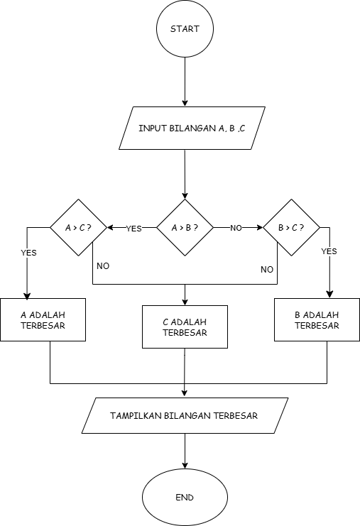

## Tugas Praktikum 3 Bahasa Pemrograman 
## Nama: Alya Febrianti
## Kelas : TI 24.A.1
# Program Mencari Bilangan Terbesar
Program sederhana untuk mencari nilai terbesar dari sekumpulan bilangan yang dimasukkan oleh pengguna menggunakan loop while True dan break statement.
## Deskripsi Program
Program ini dibuat menggunakan bahasa Python dengan fitur:
- Menggunakan while True untuk perulangan tak terbatas
- Menggunakan break statement untuk menghentikan program
- Membandingkan setiap input dengan nilai maksimum yang tersimpan
- Menampilkan bilangan terbesar yang ditemukan

 ## Flowchart Program 1
 
 ## Flowchart Program 2
 

 ## Kode Programan 1
 ```python
a = int(input ("masukan angka: "))
b = int(input ("masukan angka: "))
c = int(input ("masukan angka: "))


if a > b:
    if a > c:
        terbesar = a
    else:
        terbesar = c
else:
    if b > c:
        terbesar = b
    else:
        terbesar = c 

print (f"Bilangan Terbesar adalah {terbesar}")
```

 ## Kode Programan 2
```python
max = 0
bilangan = int(input("masukan bilangan :"))
while bilangan != 0 :
    if bilangan > max :
        max = bilangan
    bilangan = int(input("masukan bilangan :"))

print (f"bilangan terbesar= {max}")
```
## Contoh Output 1
````markdown
masukan bilangan :23
masukan bilangan :60
masukan bilangan :90
masukan bilangan :87
masukan bilangan :0
bilangan terbesar= 90
````
## Contoh Output 2
````markdown
masukan bilangan :
90
masukan bilangan
20
masukan bilangan
60
masukan bilangan
70
masukan bilangan
0
bilangan terbesar=90


** Process exited - Return Code: 0 **
Press Enter to exit terminal
````

## Cara Kerja Program 1
Program ini dimulai dengan meminta pengguna untuk memasukkan tiga angka. Setelah angka-angka tersebut dimasukkan, program menggunakan fungsi max() untuk menentukan angka yang paling besar di antara ketiga angka tersebut. Fungsi max()  secara otomatis membandingkan semua angka dan mengembalikan yang terbesar. Setelah menemukan angka terbesar, program menampilkan hasilnya kepada pengguna dengan kalimat yang jelas. Dengan cara ini, kode menjadi lebih ringkas dan mudah dibaca, tanpa perlu membuat banyak kondisi untuk perbandingan.

Bagian output menunjukkan bahwa program berhasil. Setelah memasukkan angka 90, 20, 60, 70, dan 0 program dengan tepat menemukan bahwa angka terbesar adalah 90. Ini menunjukkan bahwa logika untuk mencari angka terbesar berfungsi dengan baik.

## Cara Kerja Program 2

Program yang saya buat berfungsi untuk mencari bilangan terbesar dari input yang diberikan pengguna. Pertama, program menginisialisasi variabel max dengan nilai 0. Kemudian, program meminta pengguna untuk memasukkan bilangan. Jika bilangan yang dimasukkan bukan 0, program akan memeriksa apakah bilangan itu lebih besar dari nilai max. Jika iya, nilai max akan diperbarui dengan bilangan tersebut. Proses ini berulang hingga pengguna memasukkan 0, yang menandakan akhir dari input. Setelah itu, program mencetak bilangan terbesar yang ditemukan. 

Bagian Output
dalam contoh ini, pengguna memasukkan beberapa bilangan, dan ketika memasukkan 0, program menghentikan input dan mencetak bilangan terbesar yang dimasukkan, yaitu 90. Setelah itu, proses selesai dengan kode pengembalian 0, yang menandakan tidak ada kesalahan. Pengguna kemudian diminta untuk menekan Enter untuk keluar dari terminal.


